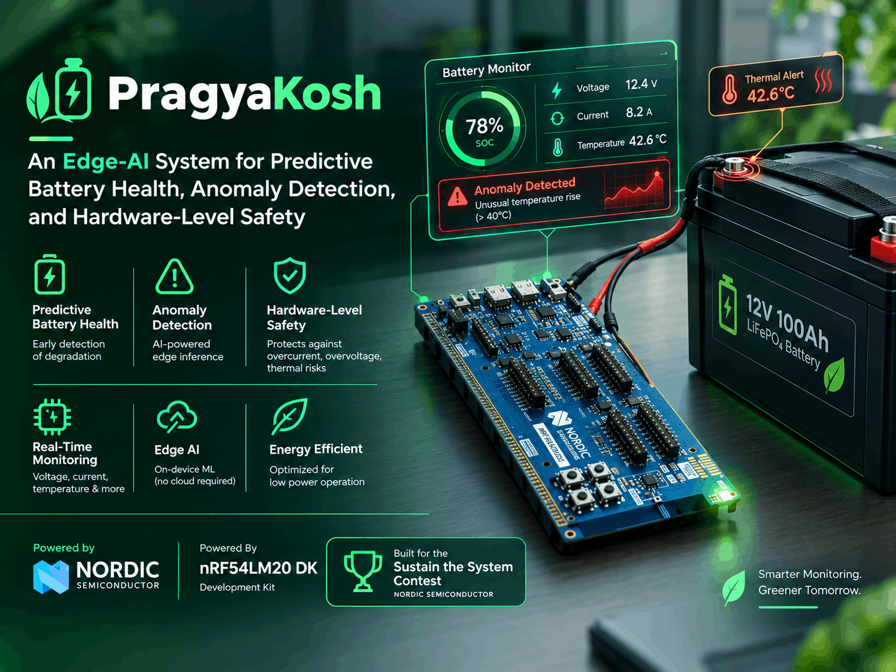
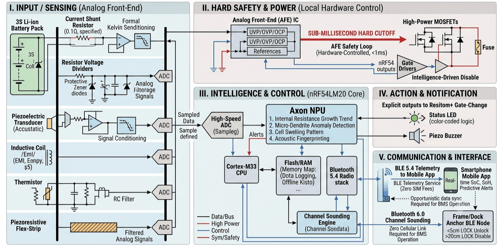

# 🔋 PragyaKosh
### *Giving Batteries a Voice Before Trouble Turns Critical*




---

> [!WARNING]
> **⚠️ Development Notice:** This project is under active concept design and early development. Hardware schematics, firmware modules, pinouts, and machine-learning architectures are preliminary and subject to change during prototyping and validation.


**Table of Contents**

[TOCM]

[TOC]


**PragyaKosh** is an Edge-AI battery health and monitoring platform designed around the **Nordic Semiconductor nRF54LM20 DK**. By combining multi-sensor data acquisition with on-device intelligence, the project explores early predictive indicators of battery degradation, cell swelling, and thermal risks before critical failures occur.

---

## 🚀 Key Features

* ⚡ **Electrical Monitoring:** Real-time sampling of battery terminal voltage and instantaneous current.
* 🌡️ **Thermal Diagnostics:** Multi-point temperature tracking for cell hot-spot detection.
* 🔊 **Physical & Mechanical Sensing:** Experimental acoustic, vibration, and mechanical strain integration.
* 🧠 **On-Device Edge AI:** Real-time anomaly detection running locally on the integrated **Axon NPU**.
* 📡 **BLE Wireless Telemetry:** Low-energy wireless communication with support for Bluetooth Channel Sounding.
* 🚨 **Hardware Safety & Local Alerts:** On-board status LED and piezo buzzer fallback indicators.
* ⚙️ **Zephyr RTOS Ecosystem:** Deterministic, modular firmware design for low-latency execution.

---

## 🏗️ System Architecture



The platform architecture is structured across four core operational layers:

1. 🔌 **Hardware & Sensing Layer** — Signal conditioning, current sensing, protective Zener/RC filtering, and PCB design.
2. ⚡ **Firmware Layer** — Zephyr RTOS sensor drivers, sample rate controllers, ADC pipeline, and safety loops.
3. 🧠 **Edge AI Layer** — Feature extraction, dataset collection, and on-device model deployment (Autoencoder / Isolation Forest).
4. 📱 **Telemetry & Interface Layer** — BLE telemetry services, custom mobile app integration, and local alert mechanisms.

---

## 📂 Repository Structure

```text
nrf54-predictive-bms/
├── src/                    # Zephyr RTOS C source code
│
├── hardware/               # Schematics, PCB layouts, & BOM files
├── scripts/                # Data logging & flashing utilities
├── mobile_app/               # Mobile Application for User Interface
├── docs/                   # Complete project documentation
└── LICENSE.md              # Open-source software license

```

---

## 📑 Documentation

| Category | Description | Reference Link |
| --- | --- | --- |
| 🔌 **Hardware & Schematics** | Datasheet, pin mapping, and analog front-end (AFE) | [`docs/hardware/`](#) |
| ⚡ **Firmware Architecture** | Zephyr RTOS modules, drivers, and tasks | [`docs/firmware/`](#)|
| 🧠 **Edge AI & Datasets** | Feature extraction, training scripts, and NPU model deployment | [`docs/ml/`](#) |
| 🛡️ **Safety & Testing** | Hazard protection rules and lab testing protocols | [`docs/hardware/safety.md`](#) |
| 📋 **Bill of Materials** | Component selection, specifications, and hardware costs | [`hardware/BOM.md`](#) |

---

## 🔄 Development Status & Roadmap


- [x] 📌 Phase 1: Concept & Architecture
- [ ] 🪛 Phase 2a: Hardware Prototyping & Programming
- [ ] 📲 Phase 2b: Firmware and Mobile Application
- [ ] 🔒 Phase 3: AI Model Training
- [ ] 🎯 Phase 4: Testing and Validation


> [!NOTE]
> The project is currently in **Phase 1 (Concept & Architecture)**. Sensor selection, BLE profiles, and algorithm candidate models are actively being evaluated prior to physical assembly and empirical testing.

---

## 📜 License

This project is licensed under the terms specified in the [`LICENSE`](LICENSE.md) file.